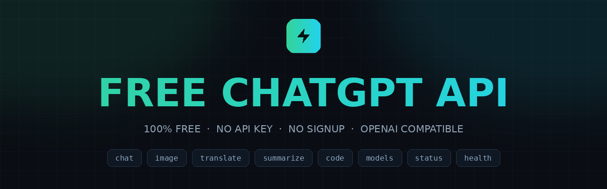
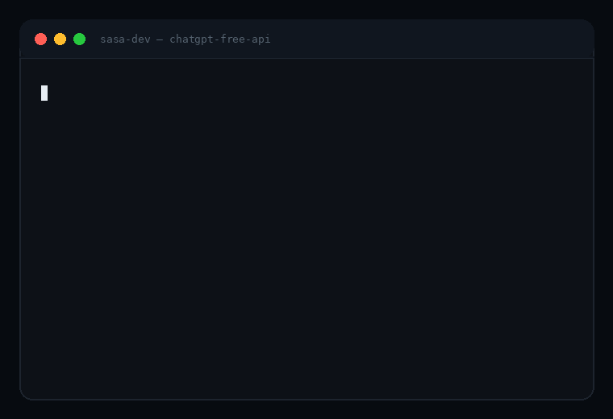

<div align="center">
  

  <p><b>A 100% free, OpenAI-compatible REST API.</b><br>No API key. No signup. No cost. Deploy it yourself in minutes.</p>

  <p>
    
    
    
    
  </p>

  
</div>

---

## Endpoints

| # | Method | Endpoint | What it does |
|---|--------|----------|--------------|
| 1 | `POST` | `/v1/chat` | Full chat completions with conversation memory. Returns an OpenAI-compatible `chat.completion` object, so existing OpenAI SDKs work by only swapping the base URL |
| 2 | `GET` | `/chat?q=hello` | Quick one-shot chat. Type a question straight in the URL and get the answer, alias of `/v1/chat` |
| 3 | `GET` | `/v1/models` | Live list of every AI model the gateway currently serves, in the OpenAI list format |
| 4 | `GET` | `/v1/image?prompt=...` | Text-to-image generation. Returns a ready-to-use JPEG with `width`, `height`, `model` and `seed` options |
| 5 | `POST` | `/v1/summarize` | Turns long articles, transcripts or documents into tight summaries. Output length: `short`, `medium` or `long` |
| 6 | `POST` | `/v1/translate` | Translates text between any languages. Source language is auto-detected when omitted |
| 7 | `POST` | `/v1/code` | A focused coding assistant for code generation, debugging and refactoring in any language |
| 8 | `GET` | `/status` | Full service status, version, uptime and the live endpoint catalogue in a single response |
| 9 | `GET` | `/health` | Feather-light liveness probe with zero upstream calls, perfect for uptime monitors and cron pings |

Every response is JSON (except `/v1/image`, which returns the raw image), CORS is fully open, and a soft limit of **60 requests per minute per IP** keeps the free tier fair. Responses include `x-ratelimit-limit`, `x-ratelimit-remaining` and `x-ratelimit-reset` headers.

## Usage

Quick test in the browser:

```
GET /v1/chat?q=hello
GET /v1/image?prompt=a+red+fox+in+snow
```

Chat with a real request body:

```bash
curl -X POST "https://your-domain/v1/chat" \
  -H "Content-Type: application/json" \
  -d '{"messages":[{"role":"user","content":"Hello!"}]}'
```

Response:

```json
{
  "ok": true,
  "model": "gpt-oss-20b",
  "choices": [{
    "message": { "role": "assistant", "content": "Hey there! How can I help you today?" },
    "finish_reason": "stop"
  }],
  "usage": { "prompt_tokens": 53, "completion_tokens": 9, "total_tokens": 62 }
}
```

<details>
<summary><b>More endpoint examples</b></summary>

```bash
curl "https://your-domain/v1/models"

curl -o art.jpg "https://your-domain/v1/image?prompt=neon+city&width=1024&height=1024"

curl -X POST "https://your-domain/v1/summarize" \
  -H "Content-Type: application/json" \
  -d '{"text":"Paste any long article here...","length":"short"}'

curl -X POST "https://your-domain/v1/translate" \
  -H "Content-Type: application/json" \
  -d '{"text":"ආයුබෝවන්","to":"English"}'

curl -X POST "https://your-domain/v1/code" \
  -H "Content-Type: application/json" \
  -d '{"prompt":"flatten a nested array","language":"javascript"}'

curl "https://your-domain/status"
curl "https://your-domain/health"
```

</details>

<details>
<summary><b>Use with the OpenAI SDK</b></summary>

```python
from openai import OpenAI

client = OpenAI(
    api_key="not-needed",
    base_url="https://your-domain/v1"
)

reply = client.chat.completions.create(
    model="openai",
    messages=[{"role": "user", "content": "Hello!"}]
)
print(reply.choices[0].message.content)
```

</details>

## Deploy

### Vercel

[](https://vercel.com/new/clone?repository-url=https://github.com/darksasa1-eng/Free-Chatgpt-Api)

Or with the CLI:

```bash
npm i -g vercel
vercel --prod
```

### Cloudflare Workers

[](https://deploy.workers.cloudflare.com/?url=https://github.com/darksasa1-eng/Free-Chatgpt-Api)

Or with the CLI:

```bash
npm i -g wrangler
wrangler login
wrangler deploy
```

Live at `https://chatgpt-free-api.<your-subdomain>.workers.dev`.

### Local

```bash
npm run dev
```

Runs on `http://localhost:3000`. No dependencies to install, no build step.

## Notes

- The landing page served at `/` includes full docs and a live chat playground
- `TEXT_API_BASE` and `IMAGE_API_BASE` environment variables let you point the gateway at any OpenAI-compatible upstream
- Community gateway project, not affiliated with OpenAI. Free inference is provided by public third-party endpoints, so availability and the model line-up can change

## Developer

Built and maintained by **Sasa Dev**

## License

[MIT](LICENSE)
